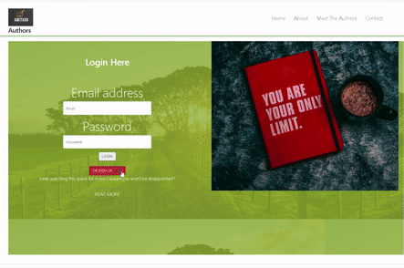

# User-Login-Authentication

User Login/Authentication demonstration application developed in Nodejs using Express, Passport, Bcryptjs & MySQL.

* Deployed on Heroku.
* JawsDB used as an Heroku add-on for providing a fully functional MySQL Database.


## Overview

 A simple login app with MySQL, Node, Express and HTML. MVC design pattern and used Node & MySQL to query and route data in the app and HRML to generate the view.

### Plans are in place to scale thhis website up. Reach me out at amitabh.k@hotmail.com for collaborating opportunities.

## Application Demo




### Getting Started:

Below is the command to install dependencies:

```
npm install

```

## Start the application

```
nodemon server.js

```
## Database

* JawsDB used as an add-on for providing a fully functional MySQL Database

* The database is 'passport_demo', with one table 'users'. This will be scaled up with couple of more tables.

Use MySQL workbench and 

```

CREATE DATABASE passport_demo;

```


## Application Links


* [Deployed-at] (http://enigmatic-savannah-06848.herokuapp.com/)

* [GitHub-repo] (https://github.com/Amitabh-K/User-Login-Authentication/)


